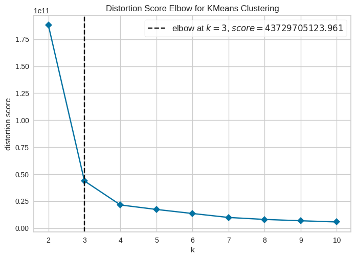

# Pycaret Projects
Using pycaret library to solve regression, classification and clustering problems

## Regression Problem
Here we use boston dataset and the best model is GBR

## Classification Problem
Here we use juice dataset and choose LDA model

## Clustering Problem
We use jewellery dataset for this task 

